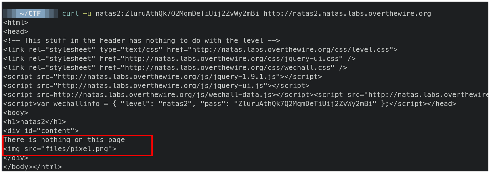
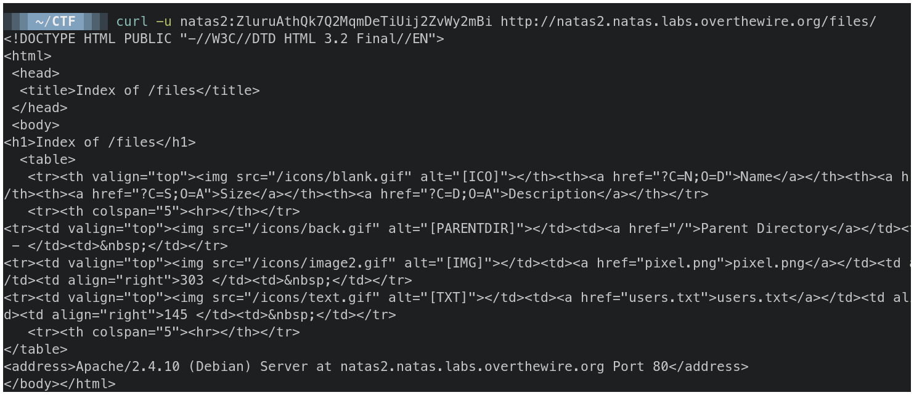

# OverTheWire - Natas 1 -> 2


## Información

```
Username: natas2
Password: ZluruAthQk7Q2MqmDeTiUij2ZvWy2mBi
URL:      http://natas2.natas.labs.overthewire.org
```


## Solución

Ejecutamos nuestro comando para visualizar la página con curl y el parámetro `-u` donde escribiremos el usuario y contraseña del reto.

```bash
curl -u natas2:ZluruAthQk7Q2MqmDeTiUij2ZvWy2mBi http://natas2.natas.labs.overthewire.org
```

El comando nos responde con el código fuente de la página. Vemos que al final nos indica que no hay nada en la página actual, pero también vemos una imagen que se encuentra dentro del directorio `files`.



Si ejecutamos el mismo comando pero agregando `/files/` al final vemos una página, pero la página es muy dificil de leer.

```bash
curl -u natas2:ZluruAthQk7Q2MqmDeTiUij2ZvWy2mBi http://natas2.natas.labs.overthewire.org/files/
```



Para solucionar esto podemos instalar un paquete llamado `html2text`.

```bash
sudo apt install html2text
```

Ahora volvemos a ejecutar el mismo comando anterior para ver la página `files` pero agregando un pipe y el comando `html2text`.

```bash
curl -u natas2:ZluruAthQk7Q2MqmDeTiUij2ZvWy2mBi http://natas2.natas.labs.overthewire.org/files/ | html2text 
```


Todo se ve mejor pero esta cabecera de curl molesta.


Podemos eliminarla agregando el parámetro `-s` al inicio del comando curl.

```bash
curl -s -u natas2:ZluruAthQk7Q2MqmDeTiUij2ZvWy2mBi http://natas2.natas.labs.overthewire.org/files/ | html2text
```


Notamos un archivo de texto con el nombre **users.txt**.


Agregamos el nombre del archivo al final de la dirección url en nuestro comando para visualizar su contenido.

```bash
curl -s -u natas2:ZluruAthQk7Q2MqmDeTiUij2ZvWy2mBi http://natas2.natas.labs.overthewire.org/files/users.txt | html2text
```


Se ve un poco desordenado así que no agregaremos el comando `html2text`.

```bash
curl -s -u natas2:ZluruAthQk7Q2MqmDeTiUij2ZvWy2mBi http://natas2.natas.labs.overthewire.org/files/users.txt
```


Notamos que ahí se encuentra la contraseña para natas3.


## Contraseña

`sJIJNW6ucpu6HPZ1ZAchaDtwd7oGrD14`